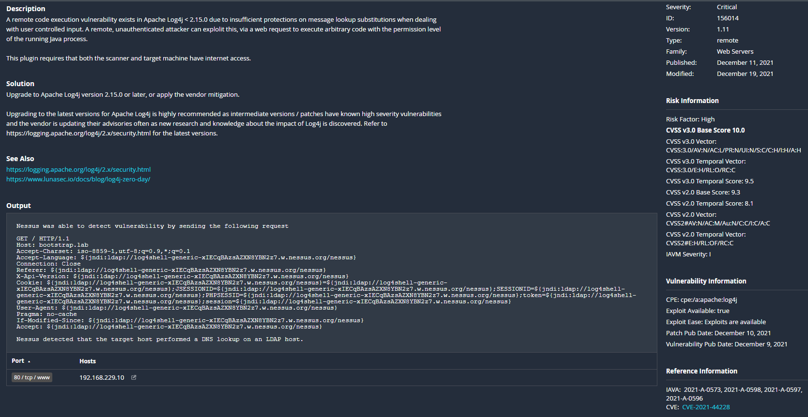

# Анализ уязвимости

Уязвимость в библиотеке Log4j, это как `COVID-19` в мире IT.

## Сравнительный отчет (Nessus 10.0.2): уязвимого приложения "spring-boot-starter-log4j2 2.6.1" и потенциально уязвимого "ELK stack 7.15.1"

Оценка уязвимости в "лоб".

### spring-boot-starter-log4j2 2.6.1

!!! info "Информация"
    Применение обходного решения по запуску приложения с параметром `Dlog4j2.formatMsgNoLookups=true`, не дало вообще результатов. RCE эксплуатация возможна. Удаление классов привело к неработоспособности приложения. При блокировки исходящих соединений в адрес атакуемого узла, RCE эксплуатация отсутствовала.

### ELK stack 7.15.1

!!! info "Информация"
    Тестирование в различных конфигурациях, как с настроенным брандмауэром, frontend'ом на nginx, аутентификацией и шифрованием соединений между компонентами стека, так без всего перечисленного, возможность эксплуатации RCE не была подтверждена. Удаление класса из библиотеки привело к неработоспособности аутентификации.

## Итоги

Самыми эффективные меры:

* Обновление до последний версии приложения
* Фильтрация запросов через WAF
* Фильтрация и блокировка исходящих соединений на firewall

Удаление класса сильно влияет на работоспособность приложения. Использование параметра `Dlog4j2.formatMsgNoLookups=true` не оказало влияние на устранение проблемы.
